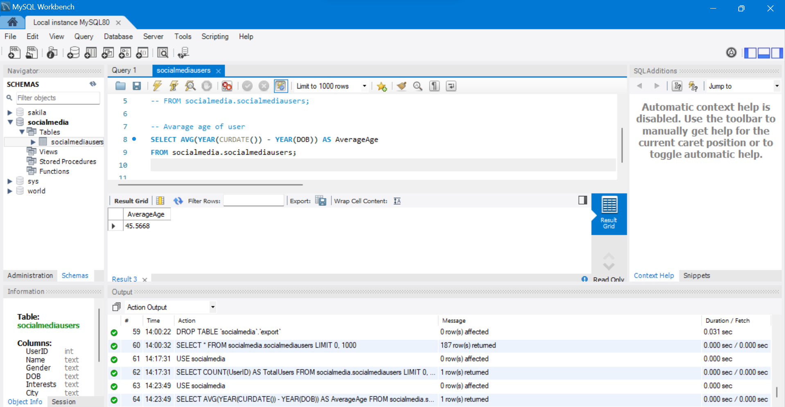
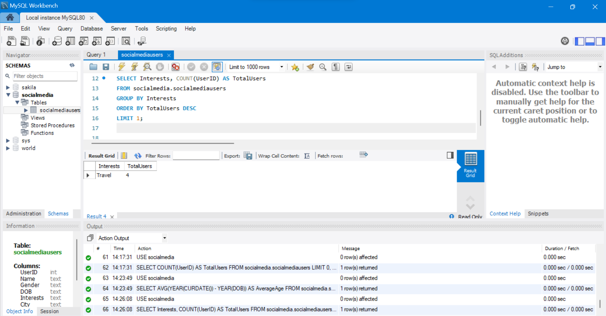
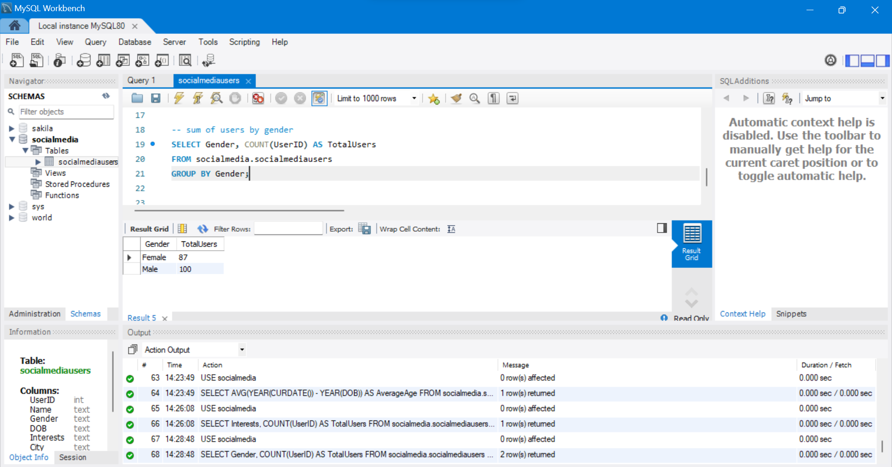
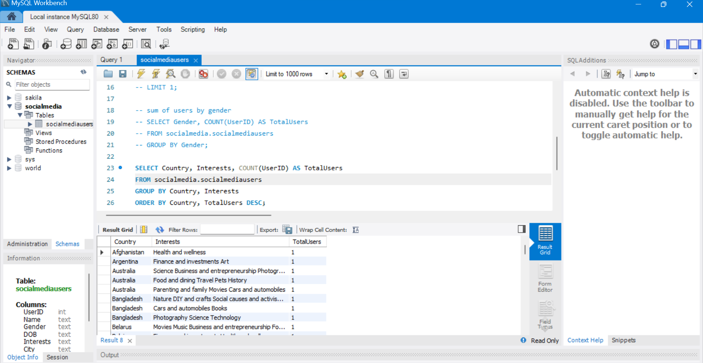
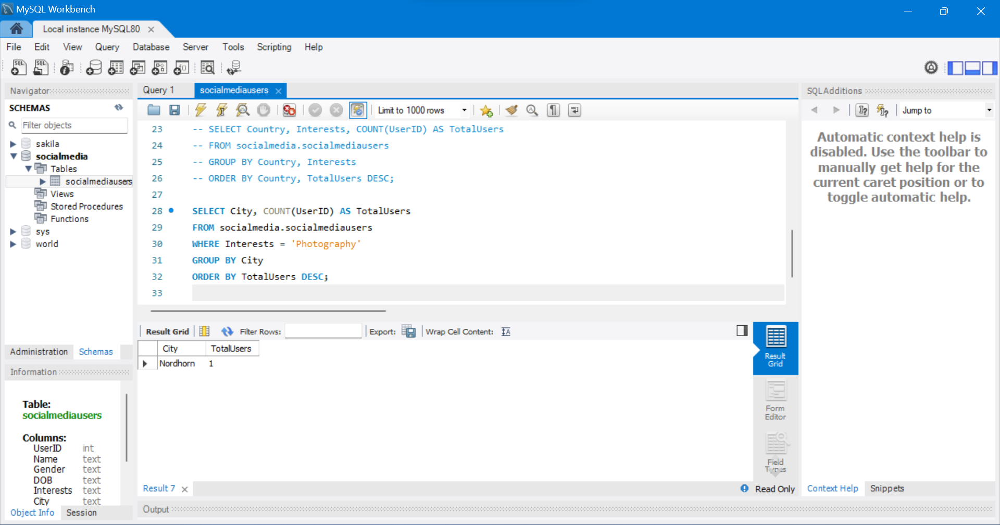

# SQL-Aggregate-Function

It is time to transform a dataset into insights using SQL and visualize your findings using charts like a data analyst pro

My main challenge was importing the raw csv dataset into mysql workbench 
The was encoding error due to the cvs file 
I resolved it by doing data clleaning using https://app.datablist.com/d/anonymous/fcdb35bbc93846018a63
I was able to import the dataset into the schema succesflly

DATA FUN

``count number of users``
`SELECT COUNT(UserID) AS TotalUsers`
`FROM socialmedia.socialmediausers; `
``

`Avarage age if Users`
SELECT AVG(YEAR(CURDATE()) - YEAR(DOB)) AS AverageAge
FROM socialmedia.socialmediausers;

`Most Popular Interest`
SELECT Interests, COUNT(UserID) AS TotalUsers
FROM socialmedia.socialmediausers
GROUP BY Interests
ORDER BY TotalUsers DESC
LIMIT 1;

`Sum of users by gender`
SELECT Gender, COUNT(UserID) AS TotalUsers
FROM socialmedia.socialmediausers
GROUP BY Gender;

`What are the most popular interests in each country?`
SELECT Country, Interests, COUNT(UserID) AS TotalUsers
FROM socialmedia.socialmediausers
GROUP BY Country, Interests
ORDER BY Country, TotalUsers DESC;

`Which cities have the highest concentration of users with a specific interest, such as "Photography"?`
SELECT City, COUNT(UserID) AS TotalUsers
FROM socialmedia.socialmediausers
WHERE Interests = 'Photography'
GROUP BY City
ORDER BY TotalUsers DESC;
